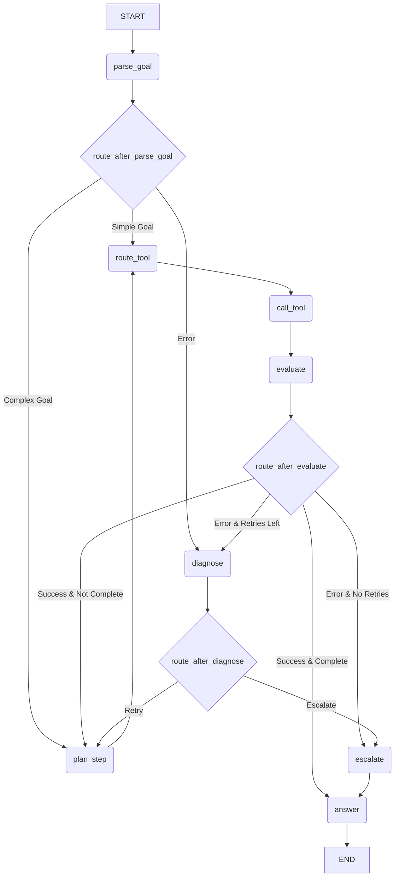

# Agent Graph Flow

This document describes the agent's graph flow as implemented in the codebase, outlining the different states (nodes) and transitions involved in completing a task. The flow is represented using a Mermaid graph that reflects the logic in `puntini/orchestration/graph.py`.

## Mermaid Graph of the Codebase

This graph shows the actual flow of control between the nodes, including the routing decisions made after parsing the goal, evaluating a step, and diagnosing an error.

## Node Responsibilities

Here are the detailed responsibilities of each node in the graph, based on their implementation in the `puntini/nodes/` directory.

### B: `parse_goal`
*   **Description**: This is the entry point of the agent. It takes the user's natural language goal and uses an LLM to parse it into a structured `GoalSpec` object. This object contains a detailed breakdown of the goal, including entities, constraints, complexity, and intent.
*   **Output**: A `GoalSpec` object that is stored in the agent's state.
*   **Routing**: After parsing, it routes to `route_after_parse_goal`, which decides the next step based on the goal's complexity. Simple goals go to `route_tool`, while complex ones go to `plan_step`. If parsing fails, it goes to `diagnose`.
*   **Key Concept**: This node implements the first step of "progressive context disclosure" by providing the LLM with minimal context to start.

### E: `plan_step`
*   **Description**: For complex goals, this node breaks down the `GoalSpec` into a series of smaller, executable steps. It uses an LLM to create a `StepPlan`, which includes a `ToolSignature` specifying the exact tool to call and the arguments to use.
*   **Input**: The `GoalSpec` and the agent's current progress.
*   **Output**: A `StepPlan` and `ToolSignature` stored in the agent's state.
*   **Routing**: After planning a step, it always routes to `route_tool`.

### D: `route_tool`
*   **Description**: This node acts as a gatekeeper before tool execution. It validates the `ToolSignature` from the `plan_step` (or `parse_goal` for simple goals). It checks if the tool exists in the `ToolRegistry` and if the provided arguments are valid.
*   **Input**: A `ToolSignature`.
*   **Routing**: If validation passes, it routes to `call_tool`. If validation fails, it routes to `diagnose`.

### G: `call_tool`
*   **Description**: This node executes the tool specified in the `ToolSignature`. It retrieves the tool's callable function from the `ToolRegistry` and runs it with the provided arguments.
*   **Input**: A validated `ToolSignature`.
*   **Output**: A normalized dictionary containing the result of the tool execution.
*   **Routing**: On success, it routes to `evaluate`. On failure, it routes to `diagnose`.

### H: `evaluate`
*   **Description**: This node evaluates the result of the tool execution. It checks the status of the result and decides whether the agent should continue, retry, or escalate.
*   **Input**: The result of the `call_tool` node.
*   **Routing**: The decision of this node is used by the `route_after_evaluate` conditional edge. Successful steps can lead back to `plan_step` (if the goal is not yet complete) or to `answer` (if the goal is complete). Failures can lead to `diagnose` or `escalate`.

### F: `diagnose`
*   **Description**: This node is triggered when a failure occurs. Its purpose is to classify the error (e.g., as "systematic", "random", or "identical") and recommend a remediation strategy. The current implementation is a placeholder and always classifies errors as "systematic".
*   **Input**: An error context.
*   **Routing**: The decision of this node is used by the `route_after_diagnose` conditional edge. It can lead back to `plan_step` for a retry or to `escalate`.

### K: `escalate`
*   **Description**: This node handles situations where the agent needs human intervention. It prepares an escalation context with a summary of the problem and a set of options for the user. The current implementation is a placeholder.
*   **Routing**: It currently always routes to `answer`.

### J: `answer`
*   **Description**: This is the final node in the graph. It synthesizes a final answer for the user, summarizing the work done by the agent. The current implementation is a placeholder.
*   **Routing**: It routes to the `END` of the graph, completing the execution.

## Available Tools

The `plan_step` node is aware of the following tools that can be used to manipulate the graph:

*   `add_node`: Creates a new node.
*   `add_edge`: Creates a new edge between two nodes.
*   `update_props`: Updates the properties of a node or edge.
*   `delete_node`: Deletes a node.
*   `delete_edge`: Deletes an edge.
*   `query_graph`: Queries the graph for information.
*   `cypher_query`: Executes a raw Cypher query.
