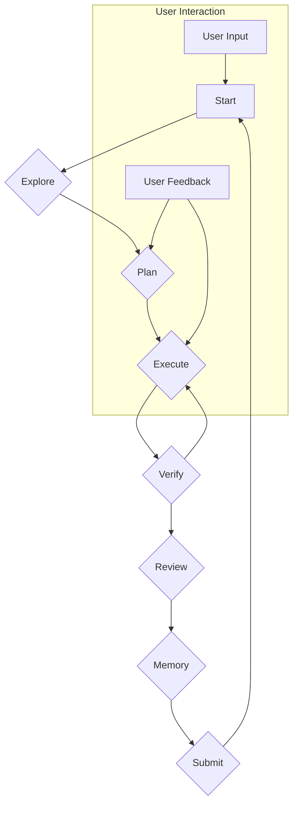

# Agent Graph Flow

This document describes the agent's graph flow, outlining the different states and transitions involved in completing a task. The flow is represented using a Mermaid graph.

## Mermaid Graph

## Node Responsibilities

### A: Start
*   **Description**: The initial state where the agent receives a task from the user.
*   **Tools**: `message_user` (to acknowledge the task).

### B: Explore
*   **Description**: The agent explores the codebase to understand the context and gather information needed to create a plan.
*   **Tools**: `ls`, `read_file`, `grep`, `view_text_website`, `google_search`.

### C: Plan
*   **Description**: The agent creates a step-by-step plan to address the user's request. The plan can be revised based on new information or user feedback.
*   **Tools**: `set_plan`, `request_user_input`.

### D: Execute
*   **Description**: The agent executes the steps outlined in the plan. This involves modifying code, running commands, and making changes to the file system.
*   **Tools**: `create_file_with_block`, `overwrite_file_with_block`, `replace_with_git_merge_diff`, `run_in_bash_session`, `delete_file`, `rename_file`.

### E: Verify
*   **Description**: After each execution step, the agent verifies that the changes were applied correctly and that the code is still functional. This often involves running tests.
*   **Tools**: `read_file`, `ls`, `grep`, `run_in_bash_session` (for running tests), `frontend_verification_instructions`, `frontend_verification_complete`.

### F: Review
*   **Description**: Before submitting the final changes, the agent requests a code review to ensure the quality of the work.
*   **Tools**: `request_code_review`.

### G: Memory
*   **Description**: The agent records important information about the task and its resolution for future reference.
*   **Tools**: `initiate_memory_recording`.

### H: Submit
*   **Description**: The agent submits the completed work, creating a commit and pull request.
*   **Tools**: `submit`.

## Tool Responsibilities

*   `ls`: List files to understand the directory structure.
*   `read_file`: Read file contents to understand the code.
*   `grep`: Search for patterns in files to locate relevant code.
*   `view_text_website`: Fetch content from a URL.
*   `google_search`: Search the web for information.
*   `set_plan`: Define or update the plan.
*   `plan_step_complete`: Mark a plan step as complete.
*   `message_user`: Communicate with the user.
*   `request_user_input`: Ask the user for information.
*   `create_file_with_block`: Create a new file with content.
*   `overwrite_file_with_block`: Overwrite an existing file with new content.
*   `replace_with_git_merge_diff`: Perform a targeted search-and-replace in a file.
*   `run_in_bash_session`: Execute shell commands for tasks like running tests or installing dependencies.
*   `delete_file`: Delete a file.
*   `rename_file`: Rename or move a file.
*   `request_code_review`: Request a review of the code changes.
*   `initiate_memory_recording`: Start recording information for future tasks.
*   `submit`: Submit the final changes.
*   `frontend_verification_instructions`: Get instructions for frontend verification.
*   `frontend_verification_complete`: Mark frontend verification as complete.

## Real-World Use Cases

Here are a couple of examples of how the agent would use this graph flow to solve real-world tasks.

### Example 1: Adding a New Feature

**User Request**: "Add a new tool to the agent that can retrieve the latest stock price for a given ticker symbol."

1.  **Start**: The agent receives the request.
2.  **Explore**: The agent uses `ls -R` to understand the project structure and `grep "tool"` to find where existing tools are defined. It reads `puntini/tools/tool_registry.py` and `puntini/interfaces/tool_registry.py`.
3.  **Plan**: The agent creates a plan using `set_plan`:
    *   Create a new file `puntini/tools/stock_price_tool.py`.
    *   Implement a `get_stock_price` function that takes a ticker symbol and returns the price.
    *   Register the new tool in `puntini/tools/tool_registry_factory.py`.
    *   Add a unit test for the new tool.
4.  **Execute & Verify**: The agent uses `create_file_with_block` to create the new tool file and `replace_with_git_merge_diff` to add the tool registration code. It then adds a test and runs it using `run_in_bash_session`.
5.  **Review**: The agent uses `request_code_review` to get feedback on the new feature.
6.  **Memory**: The agent uses `initiate_memory_recording` to remember how to add new tools.
7.  **Submit**: The agent submits the new feature with `submit`.

### Example 2: Investigating a Bug

**User Request**: "The agent is crashing when I ask it to add a node with a very long name. Please investigate and fix."

1.  **Start**: The agent receives the bug report.
2.  **Explore**: The agent uses `grep "add_node"` to find the relevant code in `puntini/graph/in_memory_graph.py`. It also looks for logs or error messages.
3.  **Plan**: The agent sets a plan:
    *   Write a failing test that reproduces the crash.
    *   Modify the `add_node` implementation to handle long names, for example by truncating them or returning a validation error.
    *   Run the tests to ensure the fix works and doesn't introduce regressions.
4.  **Execute & Verify**:
    *   The agent adds a test case to `puntini/tests/unit/test_in_memory_graph.py` that uses a very long node name and asserts that the code doesn't crash.
    *   It runs the test and confirms that it fails as expected.
    *   The agent then modifies the `add_node` function in `puntini/graph/in_memory_graph.py` to handle the long name.
    *   It runs the tests again and confirms that they all pass.
5.  **Review**: The agent requests a code review for the bug fix.
6.  **Memory**: The agent records the cause of the bug and the solution.
7.  **Submit**: The agent submits the fix.

### Handling Ambiguous Prompts

Not all user prompts are perfect. Here’s how the agent handles requests that are ambiguous or incomplete, typically by using the `request_user_input` tool to ask for clarification.

#### Example 3: Vague Bug Report

**User Request**: "Fix the bug."

1.  **Start**: The agent receives the vague request.
2.  **Plan**: The agent's immediate plan is not to code, but to gather more information. It recognizes the prompt is too ambiguous to proceed.
3.  **Execute**: The agent uses the `request_user_input` tool to ask for more details.
    *   **Agent's Response**: "I understand you want me to fix a bug. To help me get started, could you please provide some more information? For example: What is the bug? How can I reproduce it? What is the expected behavior after the fix?"
4.  **User Interaction**: The agent now waits for the user to provide the necessary details. Once the user provides a clearer prompt, the agent will go through the normal flow of exploration, planning, execution, and verification.

#### Example 4: Incomplete Feature Request

**User Request**: "Add a new API endpoint."

1.  **Start**: The agent receives the incomplete feature request.
2.  **Plan**: Similar to the vague bug report, the agent's plan is to seek clarification before attempting to write any code.
3.  **Execute**: The agent uses `request_user_input` to ask for the required specifications.
    *   **Agent's Response**: "I can help with that. To create a new API endpoint, I need some more information. Could you please tell me:
        1.  What is the purpose of the endpoint?
        2.  What should the URL path be (e.g., `/api/v1/users`)?
        3.  What HTTP method should it use (e.g., GET, POST, PUT)?
        4.  What data should it accept as input, if any?
        5.  What should the response look like?"
4.  **User Interaction**: The agent pauses and waits for the user's response. The subsequent steps will depend on the information provided by the user.
