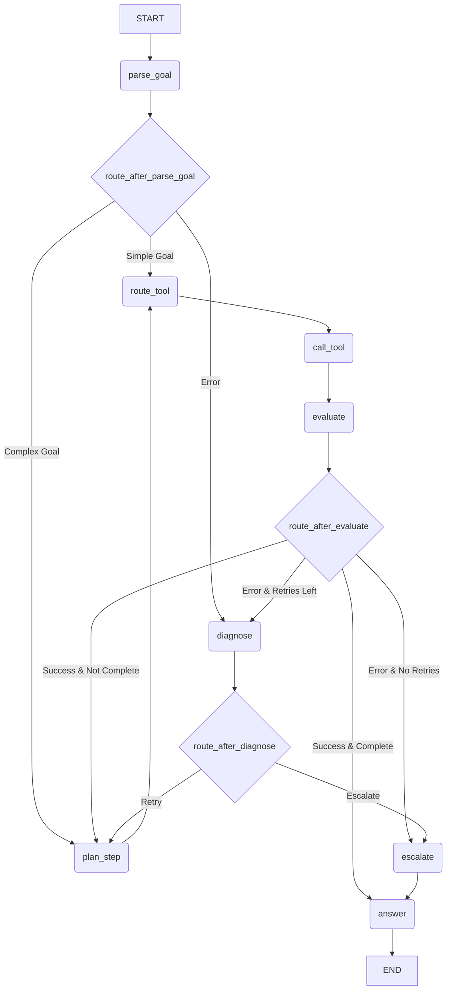

# Agent Graph Flow

This document describes the agent's graph flow as implemented in the codebase, outlining the different states (nodes) and transitions involved in completing a task. The flow is represented using a Mermaid graph that reflects the logic in `puntini/orchestration/graph.py`.

## Mermaid Graph of the Codebase

This graph shows the actual flow of control between the nodes, including the routing decisions made after parsing the goal, evaluating a step, and diagnosing an error.

## Node Responsibilities

Here are the detailed responsibilities of each node in the graph, based on their implementation in the `puntini/nodes/` directory.

### B: `parse_goal`
*   **Description**: This is the entry point of the agent. It takes the user's natural language goal and uses an LLM to parse it into a structured `GoalSpec` object. This object contains a detailed breakdown of the goal, including entities, constraints, complexity, and intent.
*   **Output**: A `GoalSpec` object that is stored in the agent's state.
*   **Routing**: After parsing, it routes to `route_after_parse_goal`, which decides the next step based on the goal's complexity. Simple goals go to `route_tool`, while complex ones go to `plan_step`. If parsing fails, it goes to `diagnose`.
*   **Key Concept**: This node implements the first step of "progressive context disclosure" by providing the LLM with minimal context to start.

### E: `plan_step`
*   **Description**: For complex goals, this node breaks down the `GoalSpec` into a series of smaller, executable steps. It uses an LLM to create a `StepPlan`, which includes a `ToolSignature` specifying the exact tool to call and the arguments to use.
*   **Input**: The `GoalSpec` and the agent's current progress.
*   **Output**: A `StepPlan` and `ToolSignature` stored in the agent's state.
*   **Routing**: After planning a step, it always routes to `route_tool`.

### D: `route_tool`
*   **Description**: This node acts as a gatekeeper before tool execution. It validates the `ToolSignature` from the `plan_step` (or `parse_goal` for simple goals). It checks if the tool exists in the `ToolRegistry` and if the provided arguments are valid.
*   **Input**: A `ToolSignature`.
*   **Routing**: If validation passes, it routes to `call_tool`. If validation fails, it routes to `diagnose`.

### G: `call_tool`
*   **Description**: This node executes the tool specified in the `ToolSignature`. It retrieves the tool's callable function from the `ToolRegistry` and runs it with the provided arguments.
*   **Input**: A validated `ToolSignature`.
*   **Output**: A normalized dictionary containing the result of the tool execution.
*   **Routing**: On success, it routes to `evaluate`. On failure, it routes to `diagnose`.

### H: `evaluate`
*   **Description**: This node evaluates the result of the tool execution. It checks the status of the result and decides whether the agent should continue, retry, or escalate.
*   **Input**: The result of the `call_tool` node.
*   **Routing**: The decision of this node is used by the `route_after_evaluate` conditional edge. Successful steps can lead back to `plan_step` (if the goal is not yet complete) or to `answer` (if the goal is complete). Failures can lead to `diagnose` or `escalate`.

### F: `diagnose`
*   **Description**: This node is triggered when a failure occurs. Its purpose is to classify the error (e.g., as "systematic", "random", or "identical") and recommend a remediation strategy. The current implementation is a placeholder and always classifies errors as "systematic".
*   **Input**: An error context.
*   **Routing**: The decision of this node is used by the `route_after_diagnose` conditional edge. It can lead back to `plan_step` for a retry or to `escalate`.

### K: `escalate`
*   **Description**: This node handles situations where the agent needs human intervention. It prepares an escalation context with a summary of the problem and a set of options for the user. The current implementation is a placeholder.
*   **Routing**: It currently always routes to `answer`.

### J: `answer`
*   **Description**: This is the final node in the graph. It synthesizes a final answer for the user, summarizing the work done by the agent. The current implementation is a placeholder.
*   **Routing**: It routes to the `END` of the graph, completing the execution.

## Available Tools

The `plan_step` node is aware of the following tools that can be used to manipulate the graph:

*   `add_node`: Creates a new node.
*   `add_edge`: Creates a new edge between two nodes.
*   `update_props`: Updates the properties of a node or edge.
*   `delete_node`: Deletes a node.
*   `delete_edge`: Deletes an edge.
*   `query_graph`: Queries the graph for information.
*   `cypher_query`: Executes a raw Cypher query.

## Comprehensive Use Cases

This section provides detailed, end-to-end examples of how the agent handles different types of user prompts.

### Use Case 1: Good Prompt (Complex Goal)

**1. User Prompt:**
"Create a new 'Ticket' node with the key 'TICKET-123' and the properties 'summary: Fix login button' and 'status: open'. Then, create a new 'User' node with the key 'john.doe' and the property 'name: John Doe'. Finally, create a 'REPORTS' edge from the 'User' node to the 'Ticket' node."

**2. Agent Workflow and Decisions:**

*   **Node: `parse_goal`**
    *   **Action**: The agent receives the prompt and sends it to the LLM to be parsed into a `GoalSpec`.
    *   **Decision**: The LLM determines that the goal is `COMPLEX` because it involves multiple steps (creating two nodes and one edge). The `is_simple_goal()` method returns `False`.
    *   **Routing**: The `route_after_parse_goal` function routes the agent to the `plan_step` node.

*   **Node: `plan_step` (First Iteration)**
    *   **Action**: The agent takes the `GoalSpec` and asks the LLM to create a `StepPlan` for the first step.
    *   **Decision**: The LLM decides that the first logical step is to create the 'Ticket' node. It generates a `ToolSignature` with `tool_name: 'add_node'` and the corresponding arguments.
    *   **Routing**: The agent proceeds to `route_tool`.

*   **Node: `route_tool` -> `call_tool`**
    *   **Action**: The `route_tool` node validates the `ToolSignature`, and `call_tool` executes the `add_node` tool.
    *   **Routing**: The tool executes successfully, so the agent proceeds to `evaluate`.

*   **Node: `evaluate`**
    *   **Action**: The agent evaluates the successful result.
    *   **Decision**: The `status` is `success`, but the goal is not yet complete.
    *   **Routing**: The `route_after_evaluate` function routes the agent back to `plan_step`.

*   **Node: `plan_step` (Second Iteration)**
    *   **Action**: The agent asks the LLM for the next step, providing the context of the completed first step.
    *   **Decision**: The LLM decides that the next step is to create the 'User' node. It generates a new `ToolSignature`.
    *   **Routing**: The agent proceeds to `route_tool`.

*   **Node: `route_tool` -> `call_tool` -> `evaluate`**
    *   **Action**: The agent creates the 'User' node and evaluates the result.
    *   **Routing**: The agent is routed back to `plan_step`.

*   **Node: `plan_step` (Third Iteration)**
    *   **Action**: The agent asks the LLM for the final step.
    *   **Decision**: The LLM decides that the final step is to create the 'REPORTS' edge. It generates the corresponding `ToolSignature`.
    *   **Routing**: The agent proceeds to `route_tool`.

*   **Node: `route_tool` -> `call_tool` -> `evaluate`**
    *   **Action**: The agent creates the edge.
    *   **Decision**: The `status` is `success`, and the LLM has previously indicated that this was the final step. The `evaluate` node sets `goal_complete` to `True`.
    *   **Routing**: `route_after_evaluate` routes the agent to `answer`.

*   **Node: `answer`**
    *   **Action**: The agent synthesizes the final answer.
    *   **Routing**: The agent proceeds to `END`.

**3. Final Result:**
The agent successfully creates the two nodes and the edge in the graph. The final answer would be a summary of the actions taken, like: "Successfully created node 'Ticket' (TICKET-123), node 'User' (john.doe), and a 'REPORTS' edge between them."

### Use Case 2: Bad Prompt (Ambiguous Request)

**1. User Prompt:**
"My dashboard is broken. Fix it."

**2. Agent Workflow and Decisions:**

*   **Node: `parse_goal`**
    *   **Action**: The agent sends the prompt to the LLM for parsing.
    *   **Decision**: The LLM is unable to extract a clear intent or any specific entities. The `GoalSpec` it generates has low confidence and a high degree of uncertainty.
    *   **Routing**: Because the parsing quality is low, the agent could be routed to `diagnose`. However, a more sophisticated implementation of `parse_goal` might recognize the need for clarification and directly trigger an escalation or a request for more information. For this example, let's assume the current implementation routes to `diagnose`.

*   **Node: `diagnose`**
    *   **Action**: The agent analyzes the parsing failure.
    *   **Decision**: The `diagnose` node (even in its placeholder form) classifies the error as "systematic" because the input is fundamentally unusable.
    *   **Routing**: `route_after_diagnose` routes the agent to `escalate`.

*   **Node: `escalate`**
    *   **Action**: The agent prepares to ask the user for help. It creates an `_escalation_context`.
    *   **Decision**: The agent needs to formulate a question for the user. A good implementation would generate a question like: "I understand your dashboard is broken, but I need more information to help. Could you please describe what is broken, what you expected to see, and any error messages you are getting?"
    *   **Routing**: The agent would typically wait for user input here. In the current implementation, it routes to `answer`.

**3. Final Result (with human interaction):**
Assuming the agent had a mechanism to wait for user input, the final result would depend on the user's response. If the user provides more details, the agent would start a new workflow to address the specific problem. If the user does not respond, the agent would time out and end the session.

### Use Case 3: Good Prompt (Simple Goal)

**1. User Prompt:**
"Find all open tickets."

**2. Agent Workflow and Decisions:**

*   **Node: `parse_goal`**
    *   **Action**: The agent parses the prompt.
    *   **Decision**: The LLM determines that the goal is `SIMPLE` and the intent is to query the graph. The `is_simple_goal()` method returns `True`.
    *   **Routing**: `route_after_parse_goal` routes the agent to `route_tool`.

*   **Node: `route_tool` -> `call_tool`**
    *   **Action**: The agent validates and executes the `query_graph` tool with a query like `MATCH (t:Ticket {status: 'open'}) RETURN t`.
    *   **Routing**: The tool executes successfully, so the agent proceeds to `evaluate`.

*   **Node: `evaluate`**
    *   **Action**: The agent evaluates the successful result.
    *   **Decision**: The `status` is `success` and the goal is complete.
    *   **Routing**: `route_after_evaluate` routes the agent to `answer`.

*   **Node: `answer`**
    *   **Action**: The agent synthesizes the final answer, which would be a list of the open tickets.
    *   **Routing**: The agent proceeds to `END`.

**3. Final Result:**
The agent returns a list of all nodes with the label 'Ticket' and the property 'status: open'.

### Use Case 4: Good Prompt (Update)

**1. User Prompt:**
"Update the status of ticket TICKET-123 to 'in progress'."

**2. Agent Workflow and Decisions:**

*   **Node: `parse_goal` -> `route_tool`**
    *   **Action**: The agent parses the simple goal and routes to `route_tool`.
    *   **Decision**: The goal is `SIMPLE` and involves updating a property.

*   **Node: `route_tool` -> `call_tool`**
    *   **Action**: The agent validates and executes the `update_props` tool.
    *   **Routing**: The tool executes successfully, so the agent proceeds to `evaluate`.

*   **Node: `evaluate` -> `answer`**
    *   **Action**: The agent evaluates the result and synthesizes the final answer.
    *   **Routing**: The agent proceeds to `END`.

**3. Final Result:**
The agent updates the 'status' property of the 'TICKET-123' node and confirms the update to the user.

### Use Case 5: Bad Prompt (Hallucination)

**1. User Prompt:**
"Use the `send_email` tool to notify the team about the new ticket."

**2. Agent Workflow and Decisions:**

*   **Node: `parse_goal` -> `route_tool`**
    *   **Action**: The agent parses the goal. The LLM might identify `send_email` as a tool.
    *   **Routing**: The agent routes to `route_tool`.

*   **Node: `route_tool`**
    *   **Action**: The agent checks the `ToolRegistry` for a tool named `send_email`.
    *   **Decision**: The tool does not exist.
    *   **Routing**: The agent routes to `diagnose`.

*   **Node: `diagnose` -> `escalate`**
    *   **Action**: The agent diagnoses the error as a `NotFoundError` and escalates.
    *   **Decision**: The agent needs to inform the user that the requested tool is not available.

**3. Final Result (with human interaction):**
The agent would inform the user: "I'm sorry, I don't have a `send_email` tool. I can create the ticket for you, but I can't send an email."

### Use Case 6: Bad Prompt (Contradictory Instructions)

**1. User Prompt:**
"Create a new ticket with the key 'TICKET-456' and the status 'open'. The ticket should be closed."

**2. Agent Workflow and Decisions:**

*   **Node: `parse_goal`**
    *   **Action**: The agent parses the prompt.
    *   **Decision**: The LLM identifies a contradiction in the constraints (status 'open' and 'closed'). The `GoalSpec` might include a note about this contradiction.
    *   **Routing**: This could lead to `diagnose` or `escalate`. A sophisticated agent would ask for clarification.

*   **Node: `escalate`**
    *   **Action**: The agent prepares to ask the user for clarification.
    *   **Decision**: The agent needs to point out the contradiction. For example: "I see a contradiction in your request. You asked for the ticket to be both 'open' and 'closed'. Could you please clarify what the status should be?"

**3. Final Result (with human interaction):**
The agent would wait for the user to resolve the contradiction before proceeding.

### Use Case 7: Bad Prompt (Out of Scope)

**1. User Prompt:**
"What's the weather like in London?"

**2. Agent Workflow and Decisions:**

*   **Node: `parse_goal`**
    *   **Action**: The agent parses the prompt.
    *   **Decision**: The LLM would recognize that the intent is not related to graph manipulation or any of the available tools. The `GoalSpec` would reflect this.
    *   **Routing**: The agent would likely route to `escalate`.

*   **Node: `escalate`**
    *   **Action**: The agent prepares to inform the user that the request is out of scope.
    *   **Decision**: The agent would generate a response like: "I'm sorry, I am a graph manipulation agent and I can't provide weather information."

**3. Final Result:**
The agent informs the user about its limitations and ends the execution.
