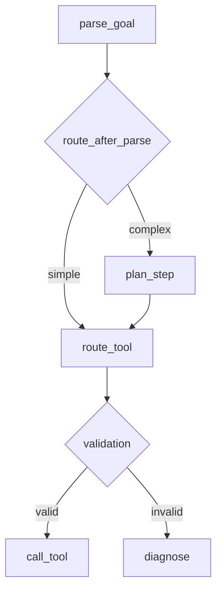
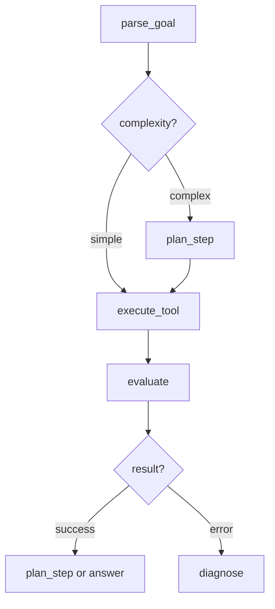

# Critical Analysis: Route and Call Tool Nodes

You're right to be skeptical. Let me dissect these nodes with brutal honesty.

## The Core Problem: Unnecessary Indirection

You have two nodes doing what should be one operation:

```
plan_step → route_tool → call_tool → evaluate
```

**What does `route_tool` actually do?**
According to your docs:
> "This node acts as a gatekeeper before tool execution. It validates the `ToolSignature`... checks if the tool exists in the `ToolRegistry` and if the provided arguments are valid."

**What does `call_tool` do?**
> "This node executes the tool specified in the `ToolSignature`. It retrieves the tool's callable function from the `ToolRegistry` and runs it."

## Why This Is Over-Engineered

### 1. Validation Should Be Part of Execution

**Current flow:**
```python
# route_tool node
def route_tool(state):
    signature = state.tool_signature
    
    # Check 1: Tool exists?
    if signature.tool_name not in registry:
        return route_to("diagnose")
    
    # Check 2: Valid args?
    if not validate_args(signature.tool_args):
        return route_to("diagnose")
    
    return route_to("call_tool")

# call_tool node
def call_tool(state):
    signature = state.tool_signature
    tool = registry.get(signature.tool_name)  # We JUST checked this exists!
    result = tool(**signature.tool_args)       # We JUST validated these args!
    return result
```

**This is absurd.** You're doing the same lookups twice, adding a full graph hop for... what?

**Better approach:**
```python
def execute_tool(state):
    signature = state.tool_signature
    
    try:
        # Validate and execute in one place
        tool = registry.get(signature.tool_name)
        if not tool:
            raise ToolNotFoundError(signature.tool_name)
        
        validated_args = tool.validate_args(signature.tool_args)
        result = tool.execute(**validated_args)
        
        return {
            "status": "success",
            "result": result
        }
    except ValidationError as e:
        return {
            "status": "validation_error",
            "error": str(e),
            "retryable": True  # LLM can fix bad args
        }
    except ToolExecutionError as e:
        return {
            "status": "execution_error",
            "error": str(e),
            "retryable": e.is_retryable
        }
```

**Result:** Two nodes → One node. No loss of functionality.

### 2. The "Gatekeeper" Pattern Is Misapplied

Gatekeeper patterns make sense when:
- The gate check is expensive and you want to fail fast
- Multiple paths lead to the same protected resource
- You need centralized authorization logic

**None of these apply here:**
- Tool registry lookup is trivial (hash table lookup)
- Only one path to `call_tool` (from `route_tool`)
- No authorization logic in your design

**You've added latency for no benefit.**

### 3. Error Routing Should Be Automatic

**Your current pattern:**
```python
route_tool → (success) → call_tool → (success) → evaluate
           ↓                      ↓
        (fail)                 (fail)
           ↓                      ↓
        diagnose              diagnose
```

**This is redundant routing logic.** Both `route_tool` and `call_tool` can fail and both route to `diagnose`.

**Better pattern:**
```python
execute_tool → evaluate
     ↓
  (error)
     ↓
  diagnose
```

**Rationale:** 
- All errors from `execute_tool` go to one place
- The `evaluate` node inspects the result and decides what to do
- No need for two separate failure paths

### 4. State Bloat from Node Splitting

Because you split this into two nodes, you need to pass state twice:

```python
# After route_tool
state.route_tool_response = RouteToolResponse(
    current_step="call_tool",
    progress=[...],
    artifacts=[...],
    failures=[...],
    result=RouteToolResult(status="validated"),
    tool_signature=signature  # Passing signature again!
)

# After call_tool  
state.call_tool_response = CallToolResponse(
    current_step="evaluate",
    progress=[...],
    artifacts=[...],
    failures=[...],
    result=CallToolResult(
        status="success",
        tool_name=signature.tool_name,  # Why store this again?
        result={...}
    )
)
```

**This is state duplication.** You're serializing, deserializing, and storing intermediate validation results that provide no value.

## What You're Actually Trying To Solve

I suspect the real motivation for `route_tool` is one of these:

### Hypothesis 1: "I want to fail fast on bad LLM outputs"

**If the LLM hallucinates a tool name or bad args, catch it before execution.**

**Counter-argument:** This is still a waste of a node. Just do it in the execution node:

```python
def execute_tool(state):
    signature = state.tool_signature
    
    # Fast validation (cheap checks)
    validation = quick_validate(signature)
    if not validation.ok:
        return {
            "status": "validation_error",
            "error": validation.error,
            "error_type": "llm_hallucination",
            "retryable": True
        }
    
    # Actual execution (expensive operation)
    result = tool.execute(**signature.tool_args)
    return result
```

**Same fast-fail behavior, no extra node.**

### Hypothesis 2: "I want centralized tool registry access"

**Maybe you're trying to enforce that all tool access goes through a validation layer.**

**Counter-argument:** That's what the `ToolRegistry` class is for:

```python
class ToolRegistry:
    def execute(self, tool_name: str, args: Dict) -> ToolResult:
        """Single point of access - validates and executes."""
        if tool_name not in self._tools:
            raise ToolNotFoundError(tool_name)
        
        tool = self._tools[tool_name]
        validated_args = tool.schema.validate(args)
        return tool.run(**validated_args)
```

**Encapsulation solves this, not graph topology.**

### Hypothesis 3: "I want to log/trace validation separately"

**Maybe you want observability into validation vs. execution.**

**Counter-argument:** Use structured logging:

```python
def execute_tool(state):
    with tracer.span("tool_execution", tool=signature.tool_name):
        with tracer.span("validation"):
            validated_args = validate(signature.tool_args)
        
        with tracer.span("execution"):
            result = tool.execute(**validated_args)
    
    return result
```

**Observability is orthogonal to node structure.**

## The Real Cost of This Design

### 1. Latency

Every node hop adds:
- State serialization/deserialization
- Network hop (if distributed)
- Queue time (if async)
- Logging overhead

**For trivial validation?** This is death by a thousand cuts.

### 2. Debugging Complexity

When something goes wrong, you have to trace through:
```
plan_step (creates signature) →
route_tool (validates signature) →
call_tool (executes signature) →
evaluate (checks result)
```

**Where did it fail?** You need to check 4 different node responses.

**Better:**
```
plan_step (creates signature) →
execute_tool (validates + executes) →
evaluate (checks result)
```

**Where did it fail?** Check execute_tool's response. Done.

### 3. Maintenance Burden

Two nodes means:
- Two sets of tests
- Two response schemas
- Two places to handle errors
- Two places to update when tool execution changes

**For what benefit?** I still don't see it.

## What You Should Do Instead

### Option 1: Merge Into One Node (Recommended)

```python
def execute_tool(state: State) -> ExecuteToolResponse:
    """Validates and executes a tool in one atomic operation."""
    signature = state.tool_signature
    
    try:
        # Get tool (fast)
        tool = state.tool_registry.get(signature.tool_name)
        if not tool:
            raise ToolNotFoundError(
                f"Tool '{signature.tool_name}' not found. "
                f"Available: {state.tool_registry.list_tools()}"
            )
        
        # Validate args (fast)
        validation_result = tool.validate_args(signature.tool_args)
        if not validation_result.valid:
            raise ValidationError(
                tool_name=signature.tool_name,
                errors=validation_result.errors,
                suggestion=validation_result.suggestion
            )
        
        # Execute (potentially slow)
        start_time = time.time()
        result = tool.execute(**signature.tool_args)
        execution_time = time.time() - start_time
        
        return ExecuteToolResponse(
            status="success",
            result=result,
            execution_time=execution_time,
            tool_name=signature.tool_name
        )
        
    except ValidationError as e:
        return ExecuteToolResponse(
            status="validation_error",
            error=str(e),
            error_type="validation",
            retryable=True,  # LLM can fix this
            suggestion=e.suggestion
        )
    
    except ToolExecutionError as e:
        return ExecuteToolResponse(
            status="execution_error",
            error=str(e),
            error_type="execution",
            retryable=e.is_retryable
        )
```

**Benefits:**
- One node instead of two
- Atomic operation (validate + execute)
- Clear error categorization
- Reduced state passing
- Better traceability

### Option 2: Keep Separate IF You Have Complex Pre-Execution Logic

**Only keep `route_tool` if you need to do something like:**

```python
def route_tool(state: State) -> RouteDecision:
    """Route to appropriate execution strategy based on tool characteristics."""
    signature = state.tool_signature
    tool = registry.get(signature.tool_name)
    
    # Complex routing logic
    if tool.requires_transaction():
        return route_to("execute_tool_transactional")
    elif tool.is_async():
        return route_to("execute_tool_async")
    elif tool.requires_external_api():
        return route_to("execute_tool_with_retry")
    else:
        return route_to("execute_tool_standard")
```

**But this isn't in your design.** All tools are executed the same way.

## The Broader Pattern: Node Proliferation

This `route_tool` + `call_tool` split is symptomatic of a larger problem in your architecture:

**You're treating graph nodes like function calls.**

```python
# What you're doing
parse_goal → route_after_parse → plan_step → route_tool → call_tool → evaluate → route_after_evaluate

# What you should be doing
parse_goal → plan_step → execute_tool → evaluate
```

**Every `route_*` node is essentially an `if` statement.** But you're making them first-class graph nodes, which:
- Adds latency
- Complicates state management
- Makes the graph harder to reason about
- Provides no abstraction benefit

### The Right Way to Use Conditional Routing

**Good use of conditional edge:**
```python
graph.add_conditional_edges(
    "evaluate",
    route_after_evaluate,
    {
        "continue": "plan_step",
        "complete": "answer",
        "error": "diagnose"
    }
)
```

**This makes sense because:**
- `evaluate` genuinely needs to make a complex decision
- Three very different next steps
- The routing logic is non-trivial

**Bad use of conditional edge (what you're doing):**
```python
graph.add_conditional_edges(
    "route_tool",
    lambda state: "call_tool" if is_valid(state) else "diagnose",
    {
        "call_tool": "call_tool",
        "diagnose": "diagnose"
    }
)
```

**This is just error handling with extra steps.**

## Specific Code Smells

### 1. Duplicate Tool Name Storage

```python
class ToolSignature:
    tool_name: str  # In the signature
    tool_args: Dict[str, Any]

class CallToolResult:
    tool_name: str  # Stored again in the result
    result: Dict[str, Any]
```

**Why?** You already have the `ToolSignature` in state. Why duplicate `tool_name` in the result?

### 2. Meaningless Status Fields

```python
class RouteToolResult:
    status: str  # "validated" - what does this tell me?
```

If `route_tool` succeeds, it routes to `call_tool`. If it fails, it routes to `diagnose`. The `status` field provides no information that isn't already conveyed by the routing decision.

**This is cargo cult programming.** You're creating fields because other result objects have them, not because they serve a purpose.

### 3. Empty Confidence Field

```python
class ToolSignature:
    confidence: float  # Confidence in what?
```

Confidence in:
- The tool choice?
- The argument values?
- The expected outcome?

**This is never used.** If confidence is low, what do you do differently? Nothing in your code checks this field.

## Recommendations

### 1. Merge the Nodes

```python
# Before: 2 nodes + routing
route_tool → call_tool

# After: 1 node
execute_tool
```

### 2. Simplify State

```python
# Before
state.tool_signature = {...}
state.route_tool_response = {...}
state.call_tool_response = {...}

# After
state.tool_signature = {...}
state.execution_result = {...}
```

### 3. Better Error Handling

```python
class ExecutionResult:
    status: Literal["success", "validation_error", "execution_error"]
    result: Optional[Dict]
    error: Optional[str]
    error_type: Optional[str]
    retryable: bool
    suggestion: Optional[str]  # How to fix the error
```

### 4. Remove Routing Nodes That Are Just If-Statements

**Current graph:**


**Simplified graph:**


**Nodes eliminated:**
- `route_after_parse` (this is just routing logic, not a node)
- `route_tool` (merged into execute_tool)
- `call_tool` (merged into execute_tool)
- `route_after_evaluate` (this is just routing logic, not a node)

## Final Verdict

**`route_tool` is unnecessary complexity.** It's a validation step that should be part of tool execution, not a separate graph node.

**Symptoms of over-engineering:**
- ✅ Two nodes doing one job
- ✅ Duplicate state storage
- ✅ Meaningless intermediate results
- ✅ No clear benefit from separation
- ✅ Added latency for trivial checks

**What to do:**
1. Merge `route_tool` and `call_tool` into `execute_tool`
2. Handle validation errors in the same try-catch as execution errors
3. Let the `evaluate` node decide what to do with failures
4. Remove the intermediate response objects

**This will:**
- Reduce graph complexity
- Improve performance
- Simplify debugging
- Make the codebase easier to understand

Your instinct was correct. Be skeptical of any node that just validates and routes—validation should be part of execution, not a separate orchestration step.